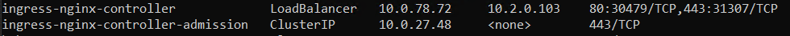
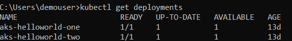
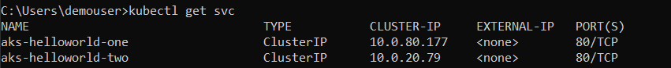

## Documentation for creating private aks having interal/private NGINX ingress along with self-signed certificates and exposing the ingress using APIM.


### Installing NGINX ingress and maing it internal.

1. Assuming that private aks is already available and helm installed, let's start by intalling NGINX ingress controller on the same.

```kubectl
helm repo add ingress-nginx https://kubernetes.github.io/ingress-nginx
helm repo update

helm install ingress-nginx ingress-nginx/ingress-nginx --namespace ingress-basic --create-namespace --namespace default
--set controller.service.annotations."service\.beta\.kubernetes\.io/azure-load-balancer-health-probe-request-path"=/healthz
--set controller.nodeSelector."kubernetes\.io/os"=linux
--set controller.admissionWebhooks.patch.nodeSelector."kubernetes\.io/os"=linux
--set defaultBackend.nodeSelector."kubernetes\.io/os"=linux --set controller.service.loadBalancerIP="" 
--set controller.service.annotations."service\.beta\.kubernetes\.io/azure-load-balancer-internal"=true # this assings a private ip from the vnet.


kubectl get deployments && kubectl get svc

```
you should get the following output for deployments and service.




2. Install basic container image on AKS
   * Head to yml_files folder and apply the demo.yml file which will pull and deploy basic image and expose it as ClusterIP.

  

  


3. Create Ingress route
  * In order to access these deployments through ingress we need to create routes so that the incomming traffic can reach the demo service.
  * Head to yml_files folder and apply ingress.yml file.
  


