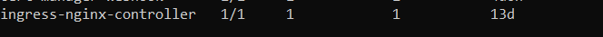

## Documentation for creating private aks having interal/private NGINX ingress along with self-signed certificates and exposing the ingress using APIM.


### Installing NGINX ingress and maing it internal.

1. Assuming that private aks is already available and helm installed, let's start by intalling NGINX ingress controller on the same.

```kubectl
helm repo add ingress-nginx https://kubernetes.github.io/ingress-nginx
helm repo update

helm install ingress-nginx ingress-nginx/ingress-nginx --namespace ingress-basic --create-namespace --namespace default
--set controller.service.annotations."service\.beta\.kubernetes\.io/azure-load-balancer-health-probe-request-path"=/healthz
--set controller.nodeSelector."kubernetes\.io/os"=linux
--set controller.admissionWebhooks.patch.nodeSelector."kubernetes\.io/os"=linux
--set defaultBackend.nodeSelector."kubernetes\.io/os"=linux --set controller.service.loadBalancerIP="" 
--set controller.service.annotations."service\.beta\.kubernetes\.io/azure-load-balancer-internal"=true # this assings a private ip from the vnet.


kubectl get deployments && kubectl get svc

```
you should get the following output for deployments and service.




2. Install basic container image on AKS
   * Head to yml_files folder and apply the demo.yml file which will pull and deploy basic image and expose it as ClusterIP.

    

    


3. Create Ingress route
    * In order to access these deployments through ingress we need to create routes so that the incomming traffic can reach the demo service.
    * Head to yml_files folder and apply ingress.yml file & run kubectl describe ingress.
  
    * 
    * 
    * If everything is correctly installed you should be able to access it using the private ip of the ingress.
  
    * 


4. Install certmanager in the cluster
   * Now we are good to go for installing cert manager on the aks, run the below command.
   * ```kubectl
      kubectl label namespace ingress-basic cert-manager.io/disable-validation=true
      # Add the Jetstack Helm repository
      helm repo add jetstack https://charts.jetstack.io
      # Update your local Helm chart repository cache
      helm repo update
      # Install CRDs with kubectl
      kubectl apply -f https://github.com/cert-manager/cert-manager/releases/download/v1.7.1/cert-manager.crds.yaml
      # Install the cert-manager Helm chart
      helm install cert-manager jetstack/cert-manager --namespace ingress-basic --version v1.7.1
      # List the installed charts
      helm list
      # verify if certmanager is installed
       kubectl get deployments && kubectl get svc
     ```

    * 
    * 


5. Create ClusterIssure and self-signed Certificate
     * Now its time to crate the certificate, go the yml_files folder and apply selfi.yml followed by cert.yml.
     * you should see the below output once created.
       
     * 
     * 

6. Create A record
     * Create an A record in private dns zone of aks with the private ip of ingress controller
     * for ex. ingresspvtaks.9d4226bf-19be-4b4f-8bfc-10cb64afde86.privatelink.eastus.azmk8s.io.

7. Redeploy ingress
     * Now we need to redeploy the ingress adding the following specs to each route.
     * This will start referring to the secret where the certs are installed.
     * ```yaml
       tls:
        - hosts:
          - ingresspvtaks.9d4226bf-19be-4b4f-8bfc-10cb64afde86.privatelink.eastus.azmk8s.io
          secretName: tlss-secret-aks
       ```
8. Download and install the ingress certificate
     * After redeploying ingress, inorder for browsers to access it service via https we need to download and install the certificates on you local machine so we will be having the private key to check the signature of the certificate.
     *  To download the certificate run the below commands
     *  
       ```kubectl
               kubectl get secret -o jsonpath="{.data['ca\.crt']}"
               [System.Text.Encoding]::UTF8.GetString([System.Convert]::FromBase64String("repace this part with base 64 output of  the above command")) | Set-Content -Path ca.crt
               kubectl get secret -o jsonpath="{.data['tls\.key']}"
               [System.Text.Encoding]::UTF8.GetString([System.Convert]::FromBase64String("repace this part with base 64 output of    the above command")) | Set-Content -Path tls.key
       ```
       * Once we have saved it locally in windows os it needs to be installed.
         *  
         *  
       *  Click on the downloaded cert to install, then select install, select local machine, select browse and click on trusted root certificate authority.
         * 
         * 
         * 
       * Next up, we should be able to see the certificate in the browser like shown below.
         * 
       * If you are able to see the certificate this means https is enabled to the ingress but you will see it in the red as 'not secured' which means even tough its https but the certificate signature is not signed/validate by a certificate authority. 


  


